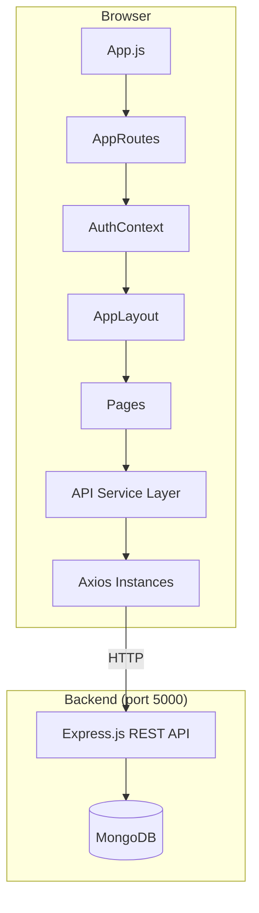
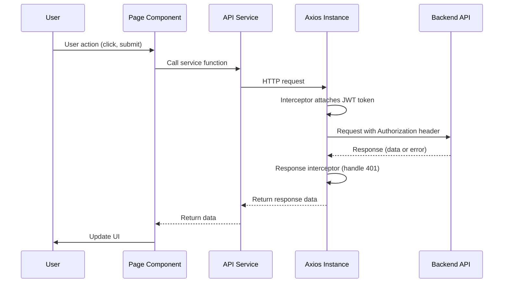
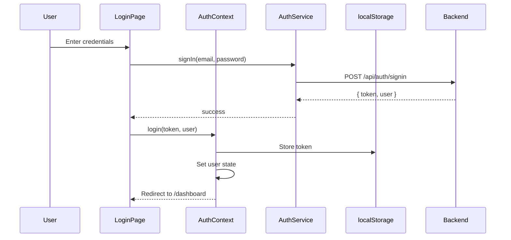
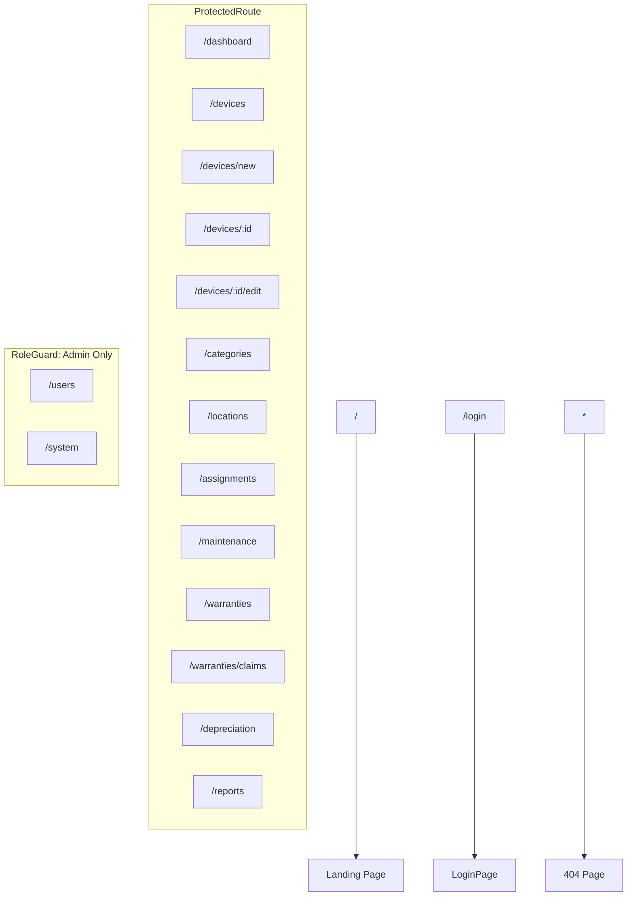

# Design Document: Frontend API Integration (EDIMS)

## Overview

Thiết kế toàn bộ frontend React cho hệ thống Quản lý Thiết bị Điện tử (EDIMS), tích hợp với backend Express.js + MongoDB. Hệ thống hiện chỉ có landing page tĩnh — cần bổ sung: tầng dịch vụ API (axios), xác thực/phân quyền (AuthContext + ProtectedRoute + RoleGuard), layout chung với sidebar, và các trang quản lý cho tất cả domain (devices, categories, locations, users, assignments, maintenance, warranties, depreciation, reports, system settings).

Frontend sử dụng React 19, react-router-dom v7, axios, inline styles, và giao diện tiếng Việt.

### Key Design Decisions

1. **React Context cho auth state** — đơn giản, không cần thêm thư viện state management cho ứng dụng CRUD.
2. **Axios interceptors** — tự động gắn token và xử lý 401 tập trung, tránh lặp logic ở mỗi service.
3. **Hai axios instances** — một cho `/api` prefix (hầu hết endpoints), một không prefix cho `/users` endpoint.
4. **Inline styles** — giữ nguyên convention hiện tại của project (landing page dùng inline styles).
5. **Flat page structure** — mỗi domain một folder trong `pages/`, không nested quá sâu.

## Architecture

### High-Level Architecture



### Request Flow



### Authentication Flow



## Components and Interfaces

### Folder Structure

```
src/
├── api/
│   ├── axiosClient.js          # Axios instances (apiClient, userClient)
│   ├── authService.js           # Auth API calls
│   ├── deviceService.js         # Device API calls
│   ├── categoryService.js       # Category API calls
│   ├── locationService.js       # Location API calls
│   ├── userService.js           # User management API calls
│   ├── assignmentService.js     # Assignment API calls
│   ├── maintenanceService.js    # Maintenance API calls
│   ├── warrantyService.js       # Warranty + claims API calls
│   ├── depreciationService.js   # Depreciation API calls
│   ├── reportService.js         # Report API calls
│   └── systemService.js         # System settings API calls
├── context/
│   └── AuthContext.js           # Auth state provider
├── components/
│   ├── ProtectedRoute.jsx       # Auth guard wrapper
│   ├── RoleGuard.jsx            # Role-based access wrapper
│   ├── AppLayout.jsx            # Sidebar + content layout
│   ├── DataTable.jsx            # Reusable paginated table
│   ├── ConfirmDialog.jsx        # Delete/destructive action confirmation
│   ├── Notification.jsx         # Toast notifications
│   ├── LoadingSpinner.jsx       # Loading indicator
│   └── FormField.jsx            # Reusable form field with validation
├── pages/
│   ├── home/home.jsx            # Existing landing page
│   ├── login/LoginPage.jsx
│   ├── dashboard/DashboardPage.jsx
│   ├── devices/
│   │   ├── DeviceListPage.jsx
│   │   ├── DeviceDetailPage.jsx
│   │   └── DeviceFormPage.jsx   # Add + Edit (shared)
│   ├── categories/CategoryPage.jsx
│   ├── locations/LocationPage.jsx
│   ├── users/UserPage.jsx
│   ├── assignments/
│   │   ├── AssignmentListPage.jsx
│   │   └── AssignmentFormPage.jsx
│   ├── maintenance/
│   │   ├── MaintenanceListPage.jsx
│   │   └── MaintenanceFormPage.jsx
│   ├── warranties/
│   │   ├── WarrantyListPage.jsx
│   │   └── WarrantyClaimPage.jsx
│   ├── depreciation/DepreciationPage.jsx
│   ├── reports/ReportsPage.jsx
│   ├── system/SystemPage.jsx
│   └── NotFoundPage.jsx
├── routes/
│   └── AppRoutes.jsx            # Centralized routing
├── App.js
└── index.js
```

### Component Interfaces

#### AuthContext

```javascript
// context/AuthContext.js
const AuthContext = {
  user: { id, email, firstName, lastName, role } | null,
  token: string | null,
  isAuthenticated: boolean,
  loading: boolean,
  login: (token, user) => void,
  logout: () => void,
}
```

#### ProtectedRoute

```jsx
// Wraps children, redirects to /login if not authenticated
// Shows loading spinner while AuthContext.loading is true
<ProtectedRoute>
  <SomeProtectedPage />
</ProtectedRoute>
```

#### RoleGuard

```jsx
// Checks user.role against allowedRoles array
// Shows "Access Denied" if role not in list
<RoleGuard allowedRoles={['admin', 'inventory_manager']}>
  <AdminOnlyContent />
</RoleGuard>
```

#### AppLayout

```jsx
// Sidebar + main content area
// Sidebar items filtered by user role
// Shows user name/role in sidebar header
// Collapsible sidebar
<AppLayout>
  <Outlet /> {/* react-router nested route content */}
</AppLayout>
```

#### DataTable

```jsx
<DataTable
  columns={[{ key, label, sortable?, render? }]}
  data={[]}
  pagination={{ page, pageSize, total }}
  onPageChange={(page) => {}}
  onSort={(key, direction) => {}}
  onRowClick={(row) => {}}
  loading={boolean}
/>
```

#### ConfirmDialog

```jsx
<ConfirmDialog
  open={boolean}
  title={string}
  message={string}
  onConfirm={() => {}}
  onCancel={() => {}}
/>
```

#### Notification (Toast)

```javascript
// Exposed via a simple module-level API
showNotification({ type: 'success' | 'error', message: string })
```

### API Service Layer Interfaces

#### axiosClient.js (Updated)

```javascript
// Primary instance — for all /api/* endpoints
const apiClient = axios.create({ baseURL: 'http://localhost:5000/api' });

// Secondary instance — for /users endpoint (no /api prefix)
const userClient = axios.create({ baseURL: 'http://localhost:5000' });

// Both instances share the same request/response interceptors:
// - Request: attach Bearer token from localStorage
// - Response: on 401, clear token + redirect to /login
```

#### authService.js

```javascript
signIn(email, password)        // POST /api/auth/signin
refreshToken(token)            // POST /api/auth/refresh-token
getProfile()                   // GET  /api/auth/me
signOut()                      // POST /api/auth/signout
updateProfile(data)            // PUT  /api/auth/profile
changePassword(data)           // PUT  /api/auth/change-password
register(data)                 // POST /api/auth/register
resetPassword(data)            // POST /api/auth/reset-password
unlockAccount(userId)          // POST /api/auth/unlock-account
```

#### deviceService.js

```javascript
// CRUD
getAllDevices(params)           // GET    /api/devices?page&limit&...
getDeviceById(id)              // GET    /api/devices/:id
addDevice(data)                // POST   /api/devices
updateDevice(id, data)         // PUT    /api/devices/:id
deleteDevice(id)               // DELETE /api/devices/:id
disposeDevice(id)              // PATCH  /api/devices/:id/dispose

// Search
searchDevices(query)           // GET    /api/devices/search?q=...
filterDevices(params)          // GET    /api/devices/filter?...
advancedSearch(params)         // GET    /api/devices/advanced-search?...

// Barcode
scanBarcode(code)              // GET    /api/devices/barcode/scan/:code
generateBarcode(deviceId)      // POST   /api/devices/barcode/generate/:deviceId
generateMultipleBarcodes(ids)  // POST   /api/devices/barcode/generate-multiple

// Labels
printAssetLabel(id)            // GET    /api/devices/label/:id
bulkPrintAssetLabels(ids)      // POST   /api/devices/labels/bulk

// Bulk
bulkImportDevices(data)        // POST   /api/devices/bulk/import
bulkExportDevices(params)      // POST   /api/devices/bulk/export
bulkUpdateStatus(data)         // PUT    /api/devices/bulk/update-status
bulkUpdateLocation(data)       // PUT    /api/devices/bulk/update-location
```

#### categoryService.js

```javascript
getAllCategories()              // GET    /api/categories
getCategoryById(id)            // GET    /api/categories/:id
createCategory(data)           // POST   /api/categories
updateCategory(id, data)       // PUT    /api/categories/:id
deleteCategory(id)             // DELETE /api/categories/:id
```

#### locationService.js

```javascript
getAllLocations()               // GET    /api/locations
getLocationById(id)            // GET    /api/locations/:id
createLocation(data)           // POST   /api/locations
updateLocation(id, data)       // PUT    /api/locations/:id
deleteLocation(id)             // DELETE /api/locations/:id
```

#### userService.js

```javascript
// Uses userClient (baseURL: http://localhost:5000, no /api prefix)
getAllUsers()                   // GET    /users
getUserById(id)                // GET    /users/:id
createUser(data)               // POST   /users
updateUser(id, data)           // PUT    /users/:id
deleteUser(id)                 // DELETE /users/:id
assignRole(id, role)           // PATCH  /users/:id/role
```

#### assignmentService.js

```javascript
getAllAssignments(params)       // GET    /api/assignments
getAssignmentById(id)          // GET    /api/assignments/:id
assignDevice(data)             // POST   /api/assignments
updateAssignment(id, data)     // PUT    /api/assignments/:id
unassignDevice(id)             // DELETE /api/assignments/:id
transferDevice(id, data)       // POST   /api/assignments/:id/transfer
getAssignmentHistory(deviceId) // GET    /api/assignments/device/:deviceId/history
getUserAssignments(userId)     // GET    /api/assignments/user/:userId
acknowledgeAssignment(id)      // PATCH  /api/assignments/:id/acknowledge
```

#### maintenanceService.js

```javascript
getAllMaintenance(params)       // GET    /api/maintenance
getMaintenanceById(id)         // GET    /api/maintenance/:id
recordMaintenance(data)        // POST   /api/maintenance/record
requestMaintenance(data)       // POST   /api/maintenance/request
scheduleMaintenance(data)      // POST   /api/maintenance/schedule
updateMaintenance(id, data)    // PUT    /api/maintenance/:id
completeMaintenance(id, data)  // PATCH  /api/maintenance/:id/complete
cancelMaintenance(id)          // PATCH  /api/maintenance/:id/cancel
getUpcomingMaintenance()       // GET    /api/maintenance/upcoming
getMaintenanceHistory(deviceId)// GET    /api/maintenance/history/:deviceId
```

#### warrantyService.js

```javascript
// Warranties
getAllWarranties(params)        // GET    /api/warranties
getWarrantyById(id)            // GET    /api/warranties/:id
createWarranty(data)           // POST   /api/warranties
updateWarranty(id, data)       // PUT    /api/warranties/:id
deleteWarranty(id)             // DELETE /api/warranties/:id
getExpiringWarranties(days)    // GET    /api/warranties/expiring/:days
refreshWarrantyStatus()        // GET    /api/warranties/refresh-status

// Warranty Claims
getAllWarrantyClaims()          // GET    /api/warranties/claims
getWarrantyClaimById(id)       // GET    /api/warranties/claims/:id
createWarrantyClaim(data)      // POST   /api/warranties/claims
updateWarrantyClaim(id, data)  // PUT    /api/warranties/claims/:id
deleteWarrantyClaim(id)        // DELETE /api/warranties/claims/:id
```

#### depreciationService.js

```javascript
getAllDepreciationRules()                // GET    /api/depreciation
getDepreciationRuleById(id)             // GET    /api/depreciation/rule/:id
getDepreciationRuleByCategory(catId)    // GET    /api/depreciation/category/:categoryId
createDepreciationRule(data)            // POST   /api/depreciation
updateDepreciationRule(id, data)        // PUT    /api/depreciation/:id
deleteDepreciationRule(id)              // DELETE /api/depreciation/:id
calculateDeviceDepreciation(deviceId)   // GET    /api/depreciation/device/:deviceId
getCategoryDepreciation(categoryId)     // GET    /api/depreciation/category-depreciation/:categoryId
batchUpdateValues()                     // POST   /api/depreciation/batch-update-values
```

#### reportService.js

```javascript
getWarrantyReport()            // GET    /api/reports/warranty
getWarrantyAlerts()            // GET    /api/reports/warranty-alerts
getDepreciationReport()        // GET    /api/reports/depreciation
getDeviceStatusReport()        // GET    /api/reports/device-status
getInventoryValueReport()      // GET    /api/reports/inventory-value
getAssignmentReport()          // GET    /api/reports/assignments
getMaintenanceReport()         // GET    /api/reports/maintenance
generateCustomReport(data)     // POST   /api/reports/custom
exportReport(data)             // POST   /api/reports/export
```

#### systemService.js

```javascript
healthCheck()                  // GET    /api/system/health
getSystemSettings()            // GET    /api/system/settings
updateSystemSetting(data)      // POST   /api/system/settings
deleteSystemSetting(key)       // DELETE /api/system/settings/:key
getDatabaseStats()             // GET    /api/system/stats
createBackup()                 // POST   /api/system/backup/create
getBackupList()                // GET    /api/system/backup/list
downloadBackup(filename)       // GET    /api/system/backup/download/:filename
deleteBackup(filename)         // DELETE /api/system/backup/delete/:filename
getSystemLogs(params)          // GET    /api/system/logs
```

### Routing Configuration



Routes wrapped in `AppLayout` (sidebar + content):
- All protected routes render inside `<AppLayout><Outlet /></AppLayout>`
- `/login` and `/` (landing) render without layout

### Role-Based Navigation Items

| Navigation Item | Route | Admin | Inventory Manager | Staff |
|---|---|---|---|---|
| Dashboard | /dashboard | ✓ | ✓ | ✓ |
| Thiết bị | /devices | ✓ | ✓ | ✓ |
| Danh mục | /categories | ✓ | ✓ | ✓ |
| Vị trí | /locations | ✓ | ✓ | ✓ |
| Phân công | /assignments | ✓ | ✓ | ✓ |
| Bảo trì | /maintenance | ✓ | ✓ | ✓ |
| Bảo hành | /warranties | ✓ | ✓ | ✓ |
| Khấu hao | /depreciation | ✓ | ✓ | ✗ |
| Báo cáo | /reports | ✓ | ✓ | ✓ |
| Người dùng | /users | ✓ | ✗ | ✗ |
| Hệ thống | /system | ✓ | ✗ | ✗ |


## Data Models

Các data model frontend tương ứng với backend MongoDB schemas. Frontend sử dụng plain JavaScript objects (không cần class/TypeScript interface vì project dùng JSX thuần).

### User

```javascript
{
  _id: string,
  email: string,
  firstName: string,
  lastName: string,
  role: 'admin' | 'inventory_manager' | 'staff',
  departmentId: string | null,
  status: 'active' | 'inactive',
  lastLogin: string | null,       // ISO date
  createdAt: string,
  updatedAt: string
}
```

### Device

```javascript
{
  _id: string,
  assetTag: string,
  serialNumber: string,
  name: string,
  categoryId: string | { _id, name, code },  // populated or ID
  manufacturer: string,
  model: string,
  specifications: object,
  purchaseDate: string | null,     // ISO date
  purchasePrice: number,
  currentValue: number,
  salvageValue: number,
  locationId: string | { _id, name, code } | null,
  status: 'available' | 'assigned' | 'in_maintenance' | 'retired',
  condition: 'new' | 'good' | 'fair' | 'poor',
  barcode: string,
  imageUrl: string,
  createdAt: string,
  updatedAt: string
}
```

### DeviceCategory

```javascript
{
  _id: string,
  name: string,
  code: string,
  description: string,
  customFields: [{ fieldName: string, fieldType: string, required: boolean }],
  depreciationRuleId: string | null,
  createdAt: string,
  updatedAt: string
}
```

### Assignment

```javascript
{
  _id: string,
  deviceId: string | { _id, name, assetTag },
  assignedTo: {
    userId: string | { _id, firstName, lastName, email },
    departmentId: string | null
  },
  assignedBy: string | { _id, firstName, lastName },
  assignmentDate: string,          // ISO date
  returnDate: string | null,
  status: 'pending' | 'acknowledged' | 'active' | 'returned',
  acknowledgedAt: string | null,
  notes: string,
  createdAt: string,
  updatedAt: string
}
```

### Location

```javascript
{
  _id: string,
  name: string,
  code: string,
  type: 'building' | 'floor' | 'room' | 'other',
  parentId: string | { _id, name } | null,
  address: string,
  createdAt: string,
  updatedAt: string
}
```

### MaintenanceRecord

```javascript
{
  _id: string,
  deviceId: string | { _id, name, assetTag },
  type: 'preventive' | 'corrective' | 'other',
  status: 'scheduled' | 'in_progress' | 'completed' | 'cancelled',
  scheduledDate: string | null,
  completedDate: string | null,
  performedBy: string | { _id, firstName, lastName } | null,
  requestedBy: string | { _id, firstName, lastName } | null,
  description: string,
  cost: number,
  notes: string,
  createdAt: string,
  updatedAt: string
}
```

### Warranty

```javascript
{
  _id: string,
  deviceId: string | { _id, name, assetTag },
  type: 'manufacturer' | 'extended' | 'other',
  provider: string,
  startDate: string | null,
  endDate: string | null,
  coverage: string,
  cost: number,
  status: 'active' | 'expired' | 'cancelled',
  createdAt: string,
  updatedAt: string
}
```

### WarrantyClaim

```javascript
{
  _id: string,
  warrantyId: string | { _id, type, provider },
  deviceId: string | { _id, name, assetTag },
  claimNumber: string,
  filedBy: string | { _id, firstName, lastName },
  filedDate: string | null,
  issue: string,
  status: 'filed' | 'in_review' | 'resolved' | 'rejected',
  resolution: string,
  createdAt: string,
  updatedAt: string
}
```

### DepreciationRule

```javascript
{
  _id: string,
  categoryId: string | { _id, name },
  method: 'straight_line' | 'declining_balance',
  usefulLifeYears: number,
  salvageValuePercent: number,
  depreciationRate: number,
  createdAt: string,
  updatedAt: string
}
```


## Correctness Properties

*A property is a characteristic or behavior that should hold true across all valid executions of a system — essentially, a formal statement about what the system should do. Properties serve as the bridge between human-readable specifications and machine-verifiable correctness guarantees.*

### Property 1: API service function-to-endpoint mapping

*For any* API service function in the service layer, calling that function with arbitrary valid arguments should result in an HTTP request with the correct method (GET/POST/PUT/PATCH/DELETE) and the correct URL path matching the backend route definition.

**Validates: Requirements 2.1, 2.2, 2.3, 2.4, 2.5, 2.6, 2.7, 2.8, 2.9, 7.1, 7.2, 7.3, 7.4, 7.5, 10.1, 11.1, 12.1, 13.1, 14.1, 15.1, 15.2, 16.1, 17.1, 18.1**

### Property 2: Token attachment on outgoing requests

*For any* JWT token string stored in localStorage, every HTTP request made through either axios instance (apiClient or userClient) should include an `Authorization: Bearer <token>` header.

**Validates: Requirements 1.2**

### Property 3: 401 response clears auth state

*For any* HTTP response with status 401 received by either axios instance, the system should remove the token from localStorage and the current route should change to `/login`.

**Validates: Requirements 1.3**

### Property 4: Auth state round trip (login/logout)

*For any* valid token and user object, calling `login(token, user)` on AuthContext should store the token in localStorage and set `isAuthenticated` to true; subsequently calling `logout()` should remove the token from localStorage, set user to null, and set `isAuthenticated` to false.

**Validates: Requirements 3.3, 3.4**

### Property 5: Protected route redirect for unauthenticated users

*For any* route path that is wrapped with ProtectedRoute, when no valid auth token exists, rendering that route should redirect to `/login`.

**Validates: Requirements 5.1, 20.2**

### Property 6: Role-based access control

*For any* user role and any route/component wrapped with RoleGuard(allowedRoles), the content should be rendered if and only if the user's role is contained in the allowedRoles array; otherwise an "Access Denied" message should be displayed.

**Validates: Requirements 5.2, 5.3, 20.3, 20.4**

### Property 7: Sidebar navigation items filtered by role

*For any* user role (admin, inventory_manager, staff), the sidebar navigation should display exactly the set of navigation items permitted for that role as defined in the role-to-navigation mapping table.

**Validates: Requirements 6.3, 17.5**

### Property 8: Sidebar displays user identity

*For any* authenticated user with a firstName, lastName, and role, the sidebar header should contain text matching that user's name and role.

**Validates: Requirements 6.2**

### Property 9: Active navigation highlighting

*For any* current route path that matches a navigation item's route, that navigation item should have a visually distinct (highlighted) style compared to non-active items.

**Validates: Requirements 6.4**

### Property 10: API error messages displayed in UI

*For any* API error response containing a message string, when a form submission or data fetch fails, the UI should render that error message text visibly to the user.

**Validates: Requirements 4.3, 9.6, 8.4**

### Property 11: Confirmation dialog before delete

*For any* delete action across all management pages (categories, locations, users, warranties, depreciation rules), clicking the delete button should first display a confirmation dialog, and the delete API call should only be made after the user confirms.

**Validates: Requirements 10.4, 11.4, 12.5**

### Property 12: Dashboard summary cards reflect data

*For any* dashboard data response containing device counts by status and total user count, the rendered summary cards should display values matching the response data.

**Validates: Requirements 8.2**

### Property 13: Device edit form pre-population

*For any* device object returned by the API, the edit form at `/devices/:id/edit` should have all form fields pre-filled with the corresponding device property values.

**Validates: Requirements 9.4**

### Property 14: Pending assignment shows acknowledge button

*For any* assignment with status "pending" viewed by a staff user, the UI should render an "Acknowledge" button; for assignments with any other status, the button should not be rendered.

**Validates: Requirements 13.4**

### Property 15: DataTable renders columns and pagination correctly

*For any* column configuration array and data array, the DataTable component should render a header cell for each column and a row for each data item, with pagination controls reflecting the total count and current page.

**Validates: Requirements 19.1**

### Property 16: Notification component displays correct type and message

*For any* notification type ('success' or 'error') and message string, the Notification component should render with the appropriate visual styling for the type and display the exact message text.

**Validates: Requirements 19.4**

### Property 17: ConfirmDialog callbacks

*For any* ConfirmDialog instance with onConfirm and onCancel callbacks, clicking the confirm button should invoke onConfirm exactly once, and clicking the cancel button should invoke onCancel exactly once.

**Validates: Requirements 19.3**

### Property 18: 404 page for undefined routes

*For any* URL path that does not match any defined route in the routing configuration, the application should render the NotFound (404) page component.

**Validates: Requirements 20.5**

### Property 19: Depreciation detail view data accuracy

*For any* device depreciation calculation response containing currentValue, purchasePrice, and depreciation schedule, the detail view should display values matching the response data.

**Validates: Requirements 16.4**

### Property 20: Form validation rejects invalid input and preserves valid input

*For any* form field with validation rules, submitting invalid input should display an error message for that field without clearing valid fields, and submitting valid input should not show any error.

**Validates: Requirements 19.2**

## Error Handling

### API Error Handling Strategy

1. **Axios Response Interceptor (Global)**
   - 401 Unauthorized → clear token, redirect to `/login`
   - 403 Forbidden → show "Access Denied" notification
   - 500 Server Error → show generic "Lỗi hệ thống" notification
   - Network Error → show "Không thể kết nối server" notification

2. **Page-Level Error Handling**
   - Each page wraps API calls in try/catch
   - On error: set local error state, display error message with retry option
   - Loading states managed per-page with `loading` boolean

3. **Form Error Handling**
   - API validation errors (422/400) → map to field-level error messages
   - Display errors below corresponding form fields
   - Keep form data intact on error (don't clear fields)

4. **Auth Error Handling**
   - Token expired during session → interceptor catches 401, redirects to login
   - Invalid token on app load → AuthContext sets user to null, shows login
   - Failed getProfile on load → clear stored token, show login page

### Error Message Format

Backend returns errors as:
```json
{ "message": "Error description", "errors": [{ "field": "email", "message": "Email is required" }] }
```

Frontend maps `errors` array to field-level messages, falls back to `message` for general errors.

## Testing Strategy

### Testing Framework

- **Unit/Integration Tests**: Jest + React Testing Library (already in package.json via react-scripts)
- **Property-Based Tests**: [fast-check](https://github.com/dubzzz/fast-check) — the standard PBT library for JavaScript/TypeScript

### Unit Tests

Unit tests cover specific examples, edge cases, and integration points:

- AuthContext: verify initial state, login/logout flows, token persistence
- ProtectedRoute: verify redirect when unauthenticated, render when authenticated
- RoleGuard: verify access denied for wrong role, render for correct role
- LoginPage: verify form rendering, submission, error display, loading state
- AppLayout: verify sidebar renders, navigation works, logout button
- DataTable: verify column rendering, pagination controls, empty state
- ConfirmDialog: verify open/close, confirm/cancel callbacks
- Each API service: verify correct endpoint URL and HTTP method (mocked axios)

### Property-Based Tests

Property tests verify universal properties across randomized inputs. Each test runs minimum 100 iterations.

Configuration:
```javascript
import fc from 'fast-check';
// Each test uses fc.assert with { numRuns: 100 } minimum
```

Property tests to implement (each references a design property):

1. **Feature: frontend-api-integration, Property 1: API service function-to-endpoint mapping** — Generate random valid arguments for each service function, mock axios, verify correct method + URL.

2. **Feature: frontend-api-integration, Property 2: Token attachment on outgoing requests** — Generate random JWT-like strings, store in localStorage, make request, verify Authorization header.

3. **Feature: frontend-api-integration, Property 3: 401 response clears auth state** — Generate random request configs, simulate 401 response, verify token removal and redirect.

4. **Feature: frontend-api-integration, Property 4: Auth state round trip** — Generate random token/user pairs, call login then logout, verify state transitions.

5. **Feature: frontend-api-integration, Property 5: Protected route redirect** — Generate random route paths from the protected routes list, render without auth, verify redirect to /login.

6. **Feature: frontend-api-integration, Property 6: Role-based access control** — Generate random (role, allowedRoles) pairs, render RoleGuard, verify access granted iff role ∈ allowedRoles.

7. **Feature: frontend-api-integration, Property 7: Sidebar navigation items filtered by role** — Generate random roles, render AppLayout, verify visible nav items match role config.

8. **Feature: frontend-api-integration, Property 8: Sidebar displays user identity** — Generate random firstName/lastName/role, render sidebar, verify text content.

9. **Feature: frontend-api-integration, Property 10: API error messages displayed in UI** — Generate random error message strings, simulate API error, verify message appears in DOM.

10. **Feature: frontend-api-integration, Property 11: Confirmation dialog before delete** — Generate random item data, click delete, verify dialog appears before API call.

11. **Feature: frontend-api-integration, Property 15: DataTable renders columns and pagination** — Generate random column configs and data arrays, render DataTable, verify header count and row count.

12. **Feature: frontend-api-integration, Property 16: Notification type and message** — Generate random type/message pairs, render Notification, verify styling and text.

13. **Feature: frontend-api-integration, Property 17: ConfirmDialog callbacks** — Generate random title/message, render dialog, click confirm/cancel, verify callback invocation.

14. **Feature: frontend-api-integration, Property 18: 404 for undefined routes** — Generate random non-matching URL paths, render router, verify NotFound page renders.

15. **Feature: frontend-api-integration, Property 20: Form validation** — Generate random invalid inputs (empty strings, whitespace, too-long strings), submit form, verify error messages appear.

### Test Organization

```
src/
├── __tests__/
│   ├── api/                    # Service layer unit tests
│   ├── components/             # Shared component tests
│   ├── context/                # AuthContext tests
│   ├── pages/                  # Page component tests
│   └── properties/             # Property-based tests (fast-check)
```
