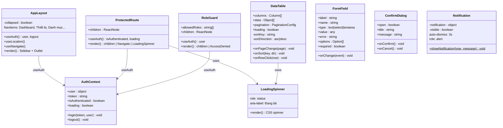
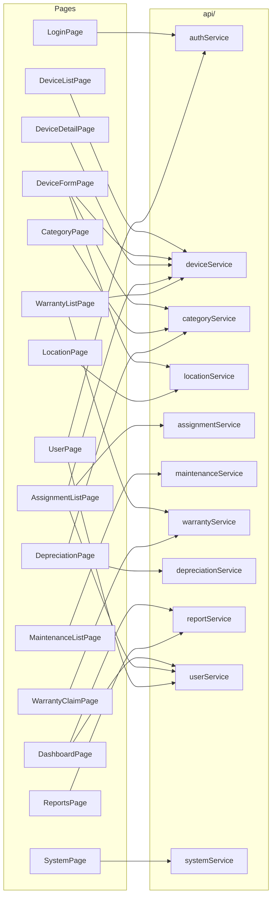
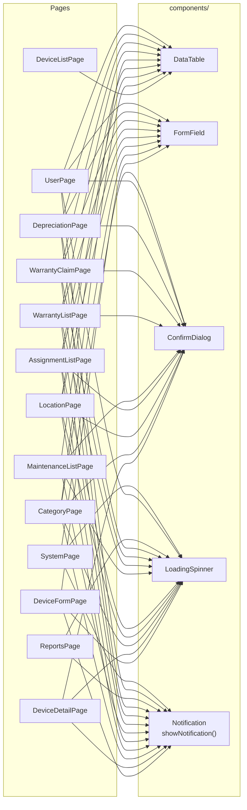
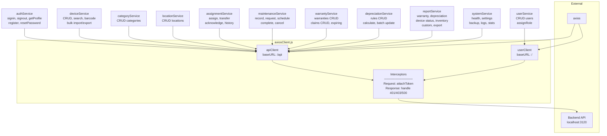
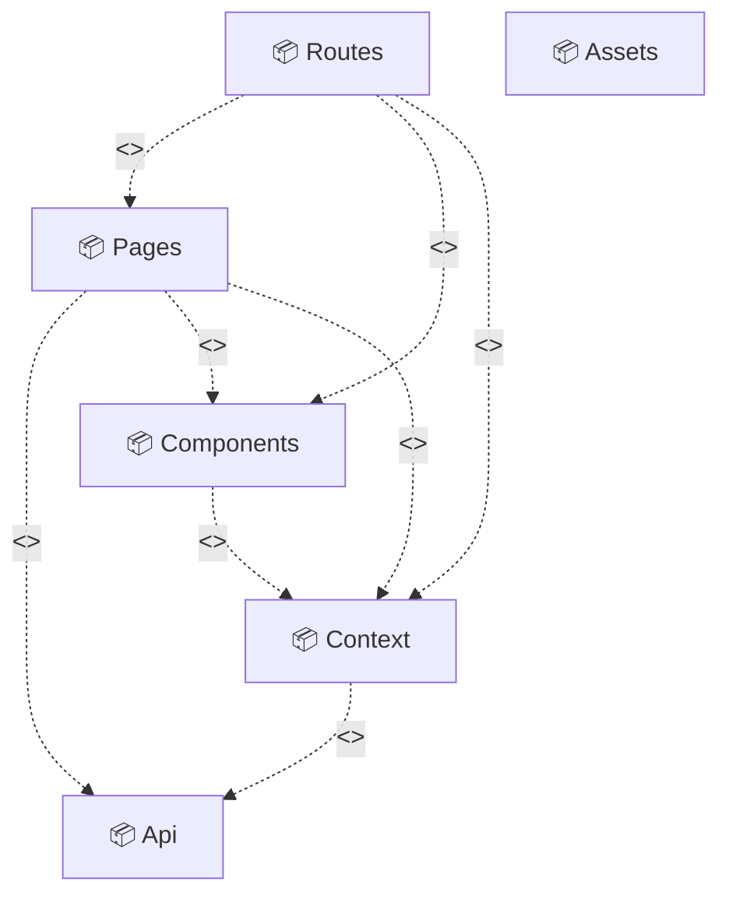

# Package Diagram (Mermaid) — Electronic Device Inventory Management Front-End

## 1. Package Diagram — Tổng quan kiến trúc

```mermaid
graph TB
    subgraph External["<<External>>"]
        REACT["react / react-dom"]
        RRD["react-router-dom"]
        AXIOS["axios"]
        BACKEND["Backend API<br/>localhost:3120"]
    end

    subgraph App["<<Application>> src/"]
        INDEX["index.js"]
        APPJS["App.js"]

        subgraph Routes["routes/"]
            APP_ROUTES["AppRoutes.jsx"]
        end

        subgraph Context["context/"]
            AUTH_CTX["AuthContext.js<br/>─────────────<br/>AuthProvider<br/>useAuth()"]
        end

        subgraph Components["components/"]
            subgraph LayoutGuards["Layout & Auth Guards"]
                APP_LAYOUT["AppLayout.jsx"]
                PROTECTED["ProtectedRoute.jsx"]
                ROLE_GUARD["RoleGuard.jsx"]
            end
            subgraph ReusableUI["Reusable UI"]
                DATA_TABLE["DataTable.jsx"]
                FORM_FIELD["FormField.jsx"]
                CONFIRM_DLG["ConfirmDialog.jsx"]
                LOADING["LoadingSpinner.jsx"]
                NOTIF["Notification.jsx<br/>─────────────<br/>showNotification()"]
            end
        end

        subgraph API["api/"]
            AXIOS_CLIENT["axiosClient.js<br/>─────────────<br/>apiClient<br/>userClient"]
            AUTH_SVC["authService.js"]
            DEVICE_SVC["deviceService.js"]
            CATEGORY_SVC["categoryService.js"]
            LOCATION_SVC["locationService.js"]
            ASSIGN_SVC["assignmentService.js"]
            MAINT_SVC["maintenanceService.js"]
            WARRANTY_SVC["warrantyService.js"]
            DEPREC_SVC["depreciationService.js"]
            REPORT_SVC["reportService.js"]
            USER_SVC["userService.js"]
            SYSTEM_SVC["systemService.js"]
        end

        subgraph Pages["pages/"]
            HOME["Home"]
            LOGIN["LoginPage"]
            DASHBOARD["DashboardPage"]
            DEV_LIST["DeviceListPage"]
            DEV_FORM["DeviceFormPage"]
            DEV_DETAIL["DeviceDetailPage"]
            CAT_PAGE["CategoryPage"]
            LOC_PAGE["LocationPage"]
            ASSIGN_PAGE["AssignmentListPage"]
            MAINT_PAGE["MaintenanceListPage"]
            WARR_LIST["WarrantyListPage"]
            WARR_CLAIM["WarrantyClaimPage"]
            DEPREC_PAGE["DepreciationPage"]
            REPORT_PAGE["ReportsPage"]
            USER_PAGE["UserPage"]
            SYSTEM_PAGE["SystemPage"]
            NOT_FOUND["NotFoundPage"]
        end

        ASSETS["assets/<br/>img, svgs"]
    end

    INDEX --> APPJS
    APPJS --> APP_ROUTES
    APPJS --> NOTIF

    APP_ROUTES --> AUTH_CTX
    APP_ROUTES --> PROTECTED
    APP_ROUTES --> ROLE_GUARD
    APP_ROUTES --> APP_LAYOUT
    APP_ROUTES --> HOME
    APP_ROUTES --> LOGIN
    APP_ROUTES --> DASHBOARD
    APP_ROUTES --> DEV_LIST
    APP_ROUTES --> DEV_FORM
    APP_ROUTES --> DEV_DETAIL
    APP_ROUTES --> CAT_PAGE
    APP_ROUTES --> LOC_PAGE
    APP_ROUTES --> ASSIGN_PAGE
    APP_ROUTES --> MAINT_PAGE
    APP_ROUTES --> WARR_LIST
    APP_ROUTES --> WARR_CLAIM
    APP_ROUTES --> DEPREC_PAGE
    APP_ROUTES --> REPORT_PAGE
    APP_ROUTES --> USER_PAGE
    APP_ROUTES --> SYSTEM_PAGE
    APP_ROUTES --> NOT_FOUND

    APP_LAYOUT --> AUTH_CTX
    APP_LAYOUT --> RRD
    PROTECTED --> AUTH_CTX
    PROTECTED --> LOADING
    ROLE_GUARD --> AUTH_CTX
    DATA_TABLE --> LOADING

    AUTH_CTX --> AUTH_SVC

    AXIOS_CLIENT --> AXIOS
    AXIOS_CLIENT --> BACKEND
    AUTH_SVC --> AXIOS_CLIENT
    DEVICE_SVC --> AXIOS_CLIENT
    CATEGORY_SVC --> AXIOS_CLIENT
    LOCATION_SVC --> AXIOS_CLIENT
    ASSIGN_SVC --> AXIOS_CLIENT
    MAINT_SVC --> AXIOS_CLIENT
    WARRANTY_SVC --> AXIOS_CLIENT
    DEPREC_SVC --> AXIOS_CLIENT
    REPORT_SVC --> AXIOS_CLIENT
    USER_SVC --> AXIOS_CLIENT
    SYSTEM_SVC --> AXIOS_CLIENT
```

---

## 2. Component Diagram — Chi tiết components

---

## 3. Pages → API Services dependency

---

## 4. Pages → Components dependency

---

## 5. API Layer — Internal structure

---

## 6. Full Dependency — Tất cả quan hệ trong 1 sơ đồ

```mermaid
graph TB
    INDEX["index.js"] --> APPJS["App.js"]
    APPJS --> NOTIF["Notification"]
    APPJS --> APP_ROUTES["AppRoutes"]

    APP_ROUTES --> AUTH_PROVIDER["AuthProvider"]
    APP_ROUTES --> PROTECTED["ProtectedRoute"]
    APP_ROUTES --> ROLE_GUARD["RoleGuard"]
    APP_ROUTES --> APP_LAYOUT["AppLayout"]

    PROTECTED --> AUTH_CTX["AuthContext<br/>useAuth()"]
    PROTECTED --> LOADING["LoadingSpinner"]
    ROLE_GUARD --> AUTH_CTX
    APP_LAYOUT --> AUTH_CTX
    AUTH_PROVIDER --> AUTH_CTX
    AUTH_CTX --> authSvc["authService"]

    DATA_TABLE["DataTable"] --> LOADING

    subgraph APILayer["api/"]
        AXIOS_CLIENT["axiosClient"]
        authSvc
        deviceSvc["deviceService"]
        categorySvc["categoryService"]
        locationSvc["locationService"]
        assignSvc["assignmentService"]
        maintSvc["maintenanceService"]
        warrantySvc["warrantyService"]
        deprecSvc["depreciationService"]
        reportSvc["reportService"]
        userSvc["userService"]
        systemSvc["systemService"]
    end

    authSvc --> AXIOS_CLIENT
    deviceSvc --> AXIOS_CLIENT
    categorySvc --> AXIOS_CLIENT
    locationSvc --> AXIOS_CLIENT
    assignSvc --> AXIOS_CLIENT
    maintSvc --> AXIOS_CLIENT
    warrantySvc --> AXIOS_CLIENT
    deprecSvc --> AXIOS_CLIENT
    reportSvc --> AXIOS_CLIENT
    userSvc --> AXIOS_CLIENT
    systemSvc --> AXIOS_CLIENT
    AXIOS_CLIENT --> AXIOS["axios"]
    AXIOS_CLIENT --> BACKEND["Backend API"]

    subgraph PagesGroup["pages/"]
        HOME["Home"]
        LOGIN["LoginPage"]
        DASHBOARD["DashboardPage"]
        DEV_LIST["DeviceListPage"]
        DEV_FORM["DeviceFormPage"]
        DEV_DETAIL["DeviceDetailPage"]
        CAT["CategoryPage"]
        LOC["LocationPage"]
        ASSIGN["AssignmentListPage"]
        MAINT["MaintenanceListPage"]
        WARR_L["WarrantyListPage"]
        WARR_C["WarrantyClaimPage"]
        DEPREC["DepreciationPage"]
        REPORT["ReportsPage"]
        USER["UserPage"]
        SYSTEM["SystemPage"]
    end

    APP_ROUTES --> HOME
    APP_ROUTES --> LOGIN
    APP_ROUTES --> DASHBOARD
    APP_ROUTES --> DEV_LIST
    APP_ROUTES --> DEV_FORM
    APP_ROUTES --> DEV_DETAIL
    APP_ROUTES --> CAT
    APP_ROUTES --> LOC
    APP_ROUTES --> ASSIGN
    APP_ROUTES --> MAINT
    APP_ROUTES --> WARR_L
    APP_ROUTES --> WARR_C
    APP_ROUTES --> DEPREC
    APP_ROUTES --> REPORT
    APP_ROUTES --> USER
    APP_ROUTES --> SYSTEM

    LOGIN --> authSvc
    DASHBOARD --> reportSvc
    DASHBOARD --> userSvc
    DEV_LIST --> deviceSvc
    DEV_LIST --> DATA_TABLE
    DEV_LIST --> AUTH_CTX
    DEV_FORM --> deviceSvc
    DEV_FORM --> categorySvc
    DEV_FORM --> locationSvc
    DEV_FORM --> FORM_FIELD["FormField"]
    DEV_FORM --> NOTIF_FN["showNotification()"]
    DEV_FORM --> LOADING
    DEV_DETAIL --> deviceSvc
    DEV_DETAIL --> CONFIRM["ConfirmDialog"]
    DEV_DETAIL --> NOTIF_FN
    DEV_DETAIL --> LOADING
    DEV_DETAIL --> AUTH_CTX
    CAT --> categorySvc
    CAT --> DATA_TABLE
    CAT --> FORM_FIELD
    CAT --> CONFIRM
    CAT --> LOADING
    CAT --> NOTIF_FN
    CAT --> AUTH_CTX
    LOC --> locationSvc
    LOC --> DATA_TABLE
    LOC --> FORM_FIELD
    LOC --> CONFIRM
    LOC --> LOADING
    LOC --> NOTIF_FN
    LOC --> AUTH_CTX
    ASSIGN --> assignSvc
    ASSIGN --> deviceSvc
    ASSIGN --> userSvc
    ASSIGN --> DATA_TABLE
    ASSIGN --> FORM_FIELD
    ASSIGN --> CONFIRM
    ASSIGN --> LOADING
    ASSIGN --> NOTIF_FN
    ASSIGN --> AUTH_CTX
    MAINT --> maintSvc
    MAINT --> DATA_TABLE
    MAINT --> CONFIRM
    MAINT --> LOADING
    MAINT --> NOTIF_FN
    MAINT --> AUTH_CTX
    WARR_L --> warrantySvc
    WARR_L --> deviceSvc
    WARR_L --> DATA_TABLE
    WARR_L --> FORM_FIELD
    WARR_L --> CONFIRM
    WARR_L --> LOADING
    WARR_L --> NOTIF_FN
    WARR_L --> AUTH_CTX
    WARR_C --> warrantySvc
    WARR_C --> DATA_TABLE
    WARR_C --> FORM_FIELD
    WARR_C --> CONFIRM
    WARR_C --> LOADING
    WARR_C --> NOTIF_FN
    WARR_C --> AUTH_CTX
    DEPREC --> deprecSvc
    DEPREC --> categorySvc
    DEPREC --> DATA_TABLE
    DEPREC --> FORM_FIELD
    DEPREC --> CONFIRM
    DEPREC --> LOADING
    DEPREC --> NOTIF_FN
    DEPREC --> AUTH_CTX
    REPORT --> reportSvc
    REPORT --> LOADING
    REPORT --> NOTIF_FN
    REPORT --> AUTH_CTX
    USER --> userSvc
    USER --> authSvc
    USER --> DATA_TABLE
    USER --> FORM_FIELD
    USER --> CONFIRM
    USER --> LOADING
    USER --> NOTIF_FN
    USER --> AUTH_CTX
    SYSTEM --> systemSvc
    SYSTEM --> CONFIRM
    SYSTEM --> LOADING
    SYSTEM --> NOTIF_FN
```

---

## 7. Package Descriptions

| No | Package | Description |
|----|---------|-------------|
| 01 | Assets | Chứa tài nguyên tĩnh (hình ảnh, SVG icons) phục vụ giao diện. Hiện chưa được import trực tiếp bởi package nào trong code. |
| 02 | Api | Tầng truy cập dữ liệu — chứa axiosClient và các service gọi Backend API (auth, device, category, location, assignment, maintenance, warranty, depreciation, report, user, system). |
| 03 | Components | Các component UI tái sử dụng: AppLayout (sidebar + layout chính), DataTable, FormField, ConfirmDialog, LoadingSpinner, Notification, ProtectedRoute, RoleGuard. |
| 04 | Context | Quản lý state toàn cục — AuthContext cung cấp AuthProvider và hook useAuth() để chia sẻ trạng thái xác thực (user, token, login, logout) cho toàn ứng dụng. |
| 05 | Pages | Các trang giao diện chính, mỗi sub-package tương ứng một chức năng: dashboard, devices, categories, locations, assignments, maintenance, warranties, depreciation, reports, users, system, login, home. |
| 06 | Routes | Định nghĩa routing — AppRoutes cấu hình tất cả đường dẫn URL, kết nối Pages với Components (layout, guards) và Context (AuthProvider). |

---

## 8. Package Relationships — Loại mũi tên và giải thích

Trong UML Package Diagram, tất cả quan hệ giữa các package trong project này đều là **dependency** (phụ thuộc), ký hiệu bằng mũi tên nét đứt `..>` với stereotype `<<use>>`.

> Mũi tên nét đứt `..>` (dependency) nghĩa là: package nguồn **sử dụng** package đích, nếu package đích thay đổi thì package nguồn có thể bị ảnh hưởng. Chiều mũi tên đi từ package phụ thuộc → package được phụ thuộc.

| No | Từ (From) | Đến (To) | Mũi tên | Stereotype | Giải thích |
|----|-----------|----------|---------|------------|------------|
| 01 | Routes | Pages | `..>` | `<<use>>` | AppRoutes import tất cả page components để định nghĩa routing. |
| 02 | Routes | Components | `..>` | `<<use>>` | AppRoutes import ProtectedRoute, RoleGuard, AppLayout để bọc các route. |
| 03 | Routes | Context | `..>` | `<<use>>` | AppRoutes import AuthProvider để bọc toàn bộ ứng dụng trong context xác thực. |
| 04 | Pages | Api | `..>` | `<<use>>` | Hầu hết các page gọi API services để lấy/gửi dữ liệu (CRUD operations). |
| 05 | Pages | Components | `..>` | `<<use>>` | Các page sử dụng DataTable, FormField, ConfirmDialog, LoadingSpinner, Notification để render UI. |
| 06 | Pages | Context | `..>` | `<<use>>` | Hầu hết page dùng useAuth() để kiểm tra quyền, lấy thông tin user (trừ Home, SystemPage). |
| 07 | Components | Context | `..>` | `<<use>>` | AppLayout, ProtectedRoute, RoleGuard dùng useAuth() để kiểm tra trạng thái đăng nhập và phân quyền. |
| 08 | Context | Api | `..>` | `<<use>>` | AuthContext gọi authService (getProfile, signOut) để xác thực và đăng xuất. |

> **Lưu ý:** Package `Assets` hiện không có mũi tên nối vì không có file nào import trực tiếp từ `assets/` trong code.

### Sơ đồ quan hệ cấp package (tổng quát)

