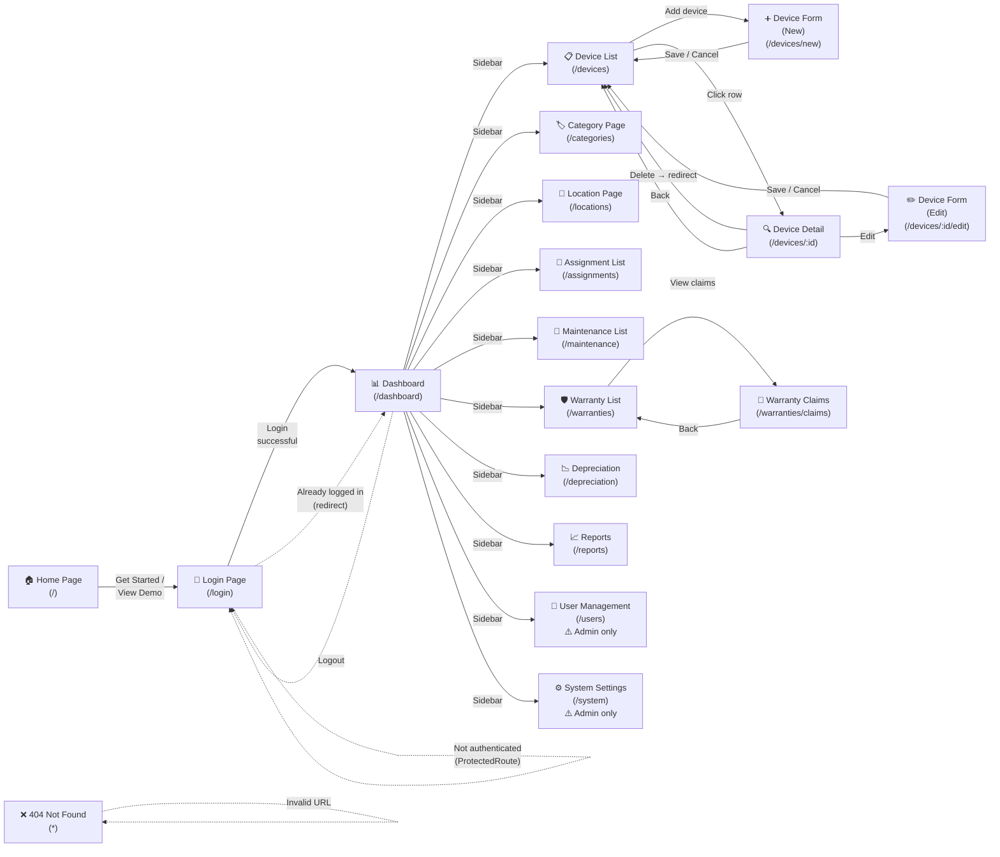

# Screen Flow — Electronic Device Inventory Management (EDIMS)

## Screen Flow Diagram

---

## Screen Descriptions

| No | Screen | Route | Description |
|----|--------|-------|-------------|
| 01 | Home Page | `/` | Public landing page introducing the EDIMS system. Contains a "Get Started" button leading to Login. |
| 02 | Login Page | `/login` | Login screen (email + password). Redirects to Dashboard if already authenticated. |
| 03 | Dashboard | `/dashboard` | Overview page after login, displaying device and user statistics. Sidebar navigates to all other pages. |
| 04 | Device List | `/devices` | Device listing with search/filter support. Click row → Device Detail, "Add" button → Device Form (New). |
| 05 | Device Form (New) | `/devices/new` | Form to add a new device. Save or Cancel → returns to Device List. |
| 06 | Device Detail | `/devices/:id` | Device details view. Edit button → Device Form (Edit), Delete → redirects to Device List, Back → Device List. |
| 07 | Device Form (Edit) | `/devices/:id/edit` | Form to edit an existing device. Save or Cancel → returns to Device List. |
| 08 | Category Page | `/categories` | Device category management (inline CRUD on the same page). |
| 09 | Location Page | `/locations` | Location/department management (inline CRUD on the same page). |
| 10 | Assignment List | `/assignments` | Device assignment listing with inline assign/transfer/acknowledge actions. |
| 11 | Maintenance List | `/maintenance` | Maintenance listing with request/schedule/complete/cancel actions. |
| 12 | Warranty List | `/warranties` | Device warranty listing (CRUD). Contains link to Warranty Claims. |
| 13 | Warranty Claims | `/warranties/claims` | Warranty claim management (create/delete claims). |
| 14 | Depreciation | `/depreciation` | Depreciation rule management and device depreciation calculation. |
| 15 | Reports | `/reports` | Consolidated reports (warranty, depreciation, device status, inventory, assignment, maintenance). |
| 16 | User Management | `/users` | User management (CRUD, role assignment). Admin access only. |
| 17 | System Settings | `/system` | System settings, backup, and logs. Admin access only. |
| 18 | 404 Not Found | `*` | Displayed when the URL does not match any defined route. |

---

## Navigation Rules

| Condition | Behavior |
|-----------|----------|
| Not authenticated + access protected route | ProtectedRoute redirects → `/login` |
| Already authenticated + access `/login` | Redirects → `/dashboard` |
| Logout (from Sidebar) | Redirects → `/login` |
| Non-Admin role + access `/users` or `/system` | RoleGuard displays "Access Denied" |
| Invalid URL | Displays 404 Not Found |

---

## Screen Descriptions (by Feature)

| # | Feature | Screen | Description |
|---|---------|--------|-------------|
| 1 | Landing | Home Page | Public landing page introducing the EDIMS system. Contains "Get Started" and "View Demo" buttons navigating to Login. |
| 2 | Authentication | Login Page | Login form with email and password fields. Redirects to Dashboard on success. Auto-redirects to Dashboard if already authenticated. |
| 3 | Overview | Dashboard | Displays summary statistics cards (total devices, available, assigned, in maintenance, retired, total users). Entry point to all features via sidebar. |
| 4 | Device Management | Device List | Paginated device table with search and filter. Click a row to view details. "Add device" button to create new device. |
| 5 | Device Management | Device Form (New) | Form to create a new device with fields for name, category, location, serial number, etc. Save or Cancel returns to Device List. |
| 6 | Device Management | Device Detail | Read-only view of a single device's information. Provides Edit, Delete, and Back actions. |
| 7 | Device Management | Device Form (Edit) | Pre-filled form to update an existing device. Save or Cancel returns to Device List. |
| 8 | Category Management | Category Page | Inline CRUD table for device categories (code, name, description). Add/Edit/Delete actions within the same page. |
| 9 | Location Management | Location Page | Inline CRUD table for locations/departments (name, building, floor). Add/Edit/Delete actions within the same page. |
| 10 | Assignment Management | Assignment List | Device assignment table with assign, transfer, and acknowledge actions. Supports inline assignment form dialog. |
| 11 | Maintenance Management | Maintenance List | Maintenance records table. Actions include request, schedule, complete, and cancel maintenance. |
| 12 | Warranty Management | Warranty List | Warranty records table (CRUD). Links to Warranty Claims page. |
| 13 | Warranty Management | Warranty Claims | Warranty claim management with create and delete claim actions. |
| 14 | Depreciation Management | Depreciation Page | Manage depreciation rules (CRUD) and calculate device depreciation by category. |
| 15 | Reporting | Reports Page | Consolidated reporting with multiple report types: warranty, depreciation, device status, inventory value, assignment, and maintenance. Supports export. |
| 16 | User Management | User Page | User CRUD with role assignment (admin, inventory_manager, staff). Includes add user form with registration. |
| 17 | System Administration | System Page | System settings management, database statistics, backup/restore, and system logs viewer. |
| 18 | Error Handling | 404 Not Found | Catch-all page displayed when the URL does not match any defined route. |

---

## Screen Authorization

The system has 3 roles: `admin`, `inventory_manager`, and `staff`. The table below maps each screen and its activities to role-based permissions.

Legend: ✓ = Allowed, — = Not allowed

| Screen | Activity | admin | inventory_manager | staff |
|--------|----------|:-----:|:-----------------:|:-----:|
| Home Page | View | ✓ | ✓ | ✓ |
| Login Page | Login | ✓ | ✓ | ✓ |
| Dashboard | View statistics | ✓ | ✓ | ✓ |
| Device List | View all devices | ✓ | ✓ | ✓ |
|  | Search / Filter devices | ✓ | ✓ | ✓ |
|  | Add new device | ✓ | ✓ | — |
| Device Detail | View device details | ✓ | ✓ | ✓ |
|  | Edit device | ✓ | ✓ | — |
|  | Delete device | ✓ | ✓ | — |
| Device Form (New) | Create device | ✓ | ✓ | — |
| Device Form (Edit) | Update device | ✓ | ✓ | — |
| Category Page | View categories | ✓ | ✓ | ✓ |
|  | Add category | ✓ | — | — |
|  | Edit category | ✓ | — | — |
|  | Delete category | ✓ | — | — |
| Location Page | View locations | ✓ | ✓ | ✓ |
|  | Add location | ✓ | — | — |
|  | Edit location | ✓ | — | — |
|  | Delete location | ✓ | — | — |
| Assignment List | View assignments | ✓ | ✓ | ✓ |
|  | Assign device | ✓ | ✓ | — |
|  | Transfer device | ✓ | ✓ | — |
|  | Acknowledge assignment | — | — | ✓ |
| Maintenance List | View maintenance records | ✓ | ✓ | ✓ |
|  | Request maintenance | ✓ | ✓ | ✓ |
|  | Schedule maintenance | ✓ | ✓ | — |
|  | Complete maintenance | ✓ | ✓ | — |
|  | Cancel maintenance | ✓ | ✓ | — |
| Warranty List | View warranties | ✓ | ✓ | ✓ |
|  | Add warranty | ✓ | ✓ | — |
|  | Edit warranty | ✓ | ✓ | — |
|  | Delete warranty | ✓ | ✓ | — |
| Warranty Claims | View claims | ✓ | ✓ | ✓ |
|  | Create claim | ✓ | ✓ | — |
|  | Delete claim | ✓ | ✓ | — |
| Depreciation Page | View depreciation rules | ✓ | ✓ | ✓ |
|  | Add rule | ✓ | ✓ | — |
|  | Edit rule | ✓ | ✓ | — |
|  | Delete rule | ✓ | ✓ | — |
|  | Calculate depreciation | ✓ | ✓ | — |
| Reports Page | View basic reports | ✓ | ✓ | ✓ |
|  | View privileged reports | ✓ | ✓ | — |
|  | Export reports | ✓ | ✓ | — |
| User Page | Access screen | ✓ | — | — |
|  | View all users | ✓ | — | — |
|  | Add user | ✓ | — | — |
|  | Edit user / Assign role | ✓ | — | — |
|  | Delete user | ✓ | — | — |
| System Page | Access screen | ✓ | — | — |
|  | View settings & stats | ✓ | — | — |
|  | Update settings | ✓ | — | — |
|  | Create / Delete backup | ✓ | — | — |
|  | View system logs | ✓ | — | — |
| 404 Not Found | View | ✓ | ✓ | ✓ |
